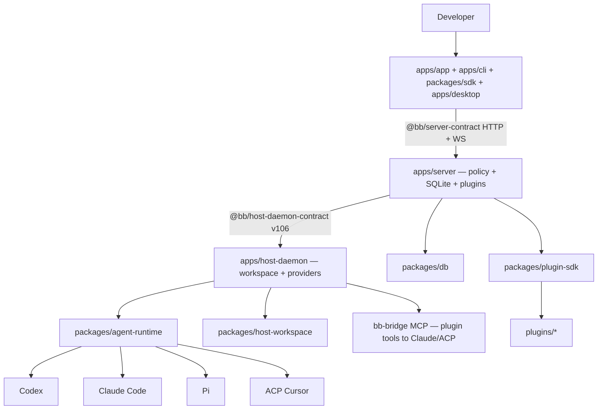
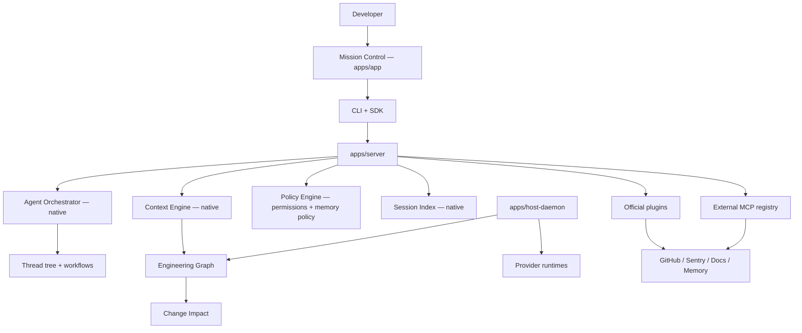

# BB Senior Engineer Control Plane — Strategic Analysis

Grounded analysis of BB as an AI-native engineering control plane, derived from [`docs/feature-suggestions.md`](feature-suggestions.md) and verified against the repository (architecture docs, packages, plugins, contracts).

**Label legend**

| Label | Meaning |
|-------|---------|
| **Already exists** | Implemented and usable today |
| **Missing** | Not implemented in repo |
| **Should integrate** | Prefer plugin / MCP / CI / external service |
| **Should build natively** | Belongs in server / daemon / app core |
| **Future / experimental** | Valuable later; defer |

**Priority framework:** P0 Essential · P1 High value · P2 Useful · P3 Experimental

---

## 1. BB Architecture Summary

BB is a **thread-centric agentic IDE** with a strict server / host-daemon / client split. The server owns product policy; the daemon owns host-local primitives; clients (app, CLI, SDK, desktop) share the same capabilities.

### Current topology

| Layer | Responsibility | Key paths |
|-------|----------------|-----------|
| **Server** | Product policy, persistence, HTTP/WS API, plugin host, skill injection, thread lifecycle | [`apps/server/`](../apps/server/), [`packages/db/`](../packages/db/), [`packages/server-contract/`](../packages/server-contract/) |
| **Host daemon** | Enrolled machine identity, workspace provisioning, provider process lifecycle, local HTTP | [`apps/host-daemon/`](../apps/host-daemon/), [`packages/host-workspace/`](../packages/host-workspace/), [`packages/host-daemon-contract/`](../packages/host-daemon-contract/) |
| **Clients** | Web UI, CLI, SDK, desktop shell | [`apps/app/`](../apps/app/), [`apps/cli/`](../apps/cli/), [`packages/sdk/`](../packages/sdk/), [`apps/desktop/`](../apps/desktop/) |

**Data model:** Project → projectSources (per host) → Environment → Thread (append-only events). Child threads, forks, and hidden workers are first-class ([`packages/domain/src/thread-child-origin.ts`](../packages/domain/src/thread-child-origin.ts), [`docs/system-overview.md`](system-overview.md)). Hierarchy depth is capped at `MAX_THREAD_HIERARCHY_DEPTH = 4` ([`apps/server/src/services/threads/thread-parent.ts`](../apps/server/src/services/threads/thread-parent.ts)).

**Wire protocol:** `HOST_DAEMON_PROTOCOL_VERSION = 106` ([`packages/host-daemon-contract/src/commands.ts`](../packages/host-daemon-contract/src/commands.ts)). Bump on any wire change ([`AGENTS.md`](../AGENTS.md)).

**Docs of record:** [`docs/system-overview.md`](system-overview.md), [`docs/repository-overview.md`](repository-overview.md), [`docs/VISION.md`](VISION.md).

### Target control-plane topology (proposed)

---

## 2. Existing Agent Capabilities

| Capability | Status | Path |
|------------|--------|------|
| Providers: Codex, Claude Code, Pi, ACP Cursor | **Already exists** | [`packages/agent-providers/src/catalog.ts`](../packages/agent-providers/src/catalog.ts) |
| Runtime adapters, turns, interactive requests | **Already exists** | [`packages/agent-runtime/src/`](../packages/agent-runtime/src/) |
| Permission modes (`accept-edits` / `auto` / `full`) + host ceiling | **Already exists** | [`packages/domain/src/shared-types.ts`](../packages/domain/src/shared-types.ts), [`apps/server/src/services/hosts/permission-ceiling.ts`](../apps/server/src/services/hosts/permission-ceiling.ts) |
| Parent/child threads (depth cap 4) | **Already exists** | [`apps/server/src/services/threads/thread-parent.ts`](../apps/server/src/services/threads/thread-parent.ts) |
| Child turn/blocker notifications to parent | **Already exists** | [`apps/server/src/services/threads/child-thread-notifications.ts`](../apps/server/src/services/threads/child-thread-notifications.ts) |
| Provider subagents (toggle; default off) | **Already exists** | [`apps/server/src/services/threads/thread-commands.ts`](../apps/server/src/services/threads/thread-commands.ts) |
| Managed git worktrees | **Already exists** | [`packages/host-workspace/`](../packages/host-workspace/), [`docs/worktrees.md`](worktrees.md) |
| Plan / goal composer modes (Codex) | **Already exists** | Provider catalog + thread activity |
| Workflows capability flag | **Already exists** (Claude Code only: `supportsWorkflows: true`) | [`packages/agent-providers/src/catalog.ts`](../packages/agent-providers/src/catalog.ts) |
| Third-party provider plugins | **Missing** | Built-in registry only |

**Senior-engineer sufficiency:** Strong for single-thread and parent/child delegation. Weak for fleet visibility, impact analysis, and cross-session memory of what was tried.

---

## 3. Existing Extension Points

| Extension | Status | Path |
|-----------|--------|------|
| Plugin SDK (backend) — settings, storage, HTTP, RPC, cron, CLI, agents, events | **Already exists** | [`packages/plugin-sdk/src/backend-contract.ts`](../packages/plugin-sdk/src/backend-contract.ts) |
| Plugin SDK (app) — slots, composer, content scripts | **Already exists** | [`packages/plugin-sdk/src/app-contract.ts`](../packages/plugin-sdk/src/app-contract.ts), [`packages/plugin-sdk/src/app.ts`](../packages/plugin-sdk/src/app.ts) |
| Skills (`SKILL.md` discovery + injection) | **Already exists** | [`apps/server/src/services/skills/`](../apps/server/src/services/skills/) |
| `contributeInstructions` / `configure` / plugin mentions | **Already exists** | Plugin SDK backend contract; [`thread-runtime-config.ts`](../apps/server/src/services/threads/thread-runtime-config.ts) |
| Lifecycle events (observe-only) | **Already exists** | `thread.created` / `active` / `idle` / `failed` / `archived` / `deleted` |
| MCP bridge (plugin dynamic tools → Claude Code / ACP) | **Already exists** | [`packages/agent-runtime/src/claude-code/bridge/tool-proxy-mcp.ts`](../packages/agent-runtime/src/claude-code/bridge/tool-proxy-mcp.ts) |
| Experimental public APIs | **Already exists** (partial) | [`docs/api_to_audit.md`](api_to_audit.md) |
| User-installable third-party plugins | **Missing** | Official/bundled catalog only ([`builtin-registry.ts`](../apps/server/src/services/plugins/builtin-registry.ts)) |
| External MCP server registry | **Missing** | No BB-native “attach MCP server” settings surface |
| Plugin pause / veto / cancel hooks | **Missing** | Events are observe-only |

Authoring reference: [`apps/server/src/services/skills/builtin-skills/bb-plugin-authoring/SKILL.md`](../apps/server/src/services/skills/builtin-skills/bb-plugin-authoring/SKILL.md). Examples (not shipped): [`examples/plugins/`](../examples/plugins/).

---

## 4. Existing Plugins / Tools / Integrations

Registry: [`apps/server/src/services/plugins/builtin-registry.ts`](../apps/server/src/services/plugins/builtin-registry.ts).

### Auto-installed builtins (`autoInstall: true`) — 9

| Plugin | `defaultEnabled` | Role |
|--------|------------------|------|
| `automations` | true | Scheduled agent/script runs |
| `connect` | true | Remote access via getbb.app |
| `custom-instructions` | true | Per-host standing instructions |
| `inline-vis` | true | Inline HTML visualizations |
| `secrets` | true | Credential prompts → dotenv |
| `side-chat` | true | Hidden side-chat fork panel |
| `ask-user-question` | false | Multi-choice questions for non-Claude providers |
| `provider-retry` | false | Resume after subscription limits |
| `workflows` | false | QuickJS multi-agent orchestration |

### Official store plugins (`autoInstall: false`) — 8

| Plugin | `defaultEnabled` on install | Role |
|--------|-----------------------------|------|
| `github` | true | Issues/PRs, mentions, send-to-agent |
| `docs` (`simple-notes`) | true | Markdown vaults |
| `memory` | true | Cross-provider durable memory (FTS5) |
| `tasks` | true | Task board + delegation presets |
| `decisions` | true | ADRs in `.bb/decisions/` |
| `autonomous-backlog` | true | Agent-generated tech-debt queue |
| `summary-hub` | true | Daily/weekly operational roll-ups |
| `agent-roster` | true | Named agents + spatial office UI |

### Surfaces

- **CLI / SDK:** [`apps/cli/`](../apps/cli/), [`packages/sdk/`](../packages/sdk/) — every end-user feature should remain dual-surfaced ([`AGENTS.md`](../AGENTS.md)).
- **Generated skill:** plugin CLI metadata → `plugin-commands` skill ([`apps/server/src/services/plugins/plugin-commands-skill.js`](../apps/server/src/services/plugins/plugin-commands-skill.js)).
- **Sync rule for CLI changes:** [`docs/cli-guide-and-skill.md`](cli-guide-and-skill.md).

---

## 5. Capability Gaps

| Area | BB Today | Gap | Recommended solution |
|------|----------|-----|----------------------|
| **Codebase Intelligence** | Git status/diff; agent grep/read | No symbol / dependency / call graph | **Should build natively** — Engineering Graph |
| **Context Engineering** | Fixed instruction stack + char caps | No ranking, semantic retrieval, span provenance | **Should build natively** — Context Engine |
| **Agent Orchestration** | Thread tree + siloed plugins | No unified task graph / kernel orchestrator | **Should build natively** + enable workflows |
| **Mission Control** | Per-thread timeline + plugin UIs | No fleet dashboard | **Should build natively** |
| **Session Intelligence** | Per-thread events | No cross-session replay / cost rollup | **Should build natively** — Session Index |
| **Change Impact** | Git dirty state | No blast-radius / test mapping | **Should build natively** |
| **Git / PR Intelligence** | GitHub plugin + thread PR banner | No commit → check → review graph | **Should integrate** (github) + native CI context |
| **Testing Intelligence** | Agent shell tests | No impact-based selection | Native test graph + **Skill** |
| **Production Intelligence** | Connect + local logs | No Sentry / OTel / prod→commit | **Should integrate** (MCP / plugin) |
| **Security Intelligence** | Permissions + secrets | No SAST / vuln scan pipeline | **Should integrate** (CI) + **Skill** |
| **Architecture Intelligence** | Decisions ADRs | No queryable architecture map | Extend decisions + Engineering Graph |
| **Memory depth** | FTS5 + catalog | Embeddings / reflection deferred | **Future / experimental** |
| **External MCP** | bb-bridge only | No user MCP registry | **Should build natively** |
| **Third-party plugins** | Bundled catalog only | No external install | **Future / experimental** |

---

## 6. Senior Engineer Requirements

A senior engineer opening BB today can answer **"what is this thread doing?"** but not easily:

1. What are **all** my agents doing across projects?
2. What changed in this **session** (not just this thread)?
3. What **could break** from this edit?
4. What approaches were **already tried**?
5. What **CI / production signals** are relevant?
6. What technical debt did we create?
7. What architectural decisions apply?
8. What should I validate next?
9. Which agents/tools should handle the work?
10. What happened in previous sessions?

**Already exists:** thread lifecycle, permissions, child notifications, plugin delegation (tasks / roster / workflows), summary-hub rollups, worktrees, PR banners.

**Missing:** unified control plane answering the ten questions in feature-suggestions’ Final Principle.

**Target experience:** BB should feel like a **Senior Engineer Control Plane with an autonomous engineering team inside it**, not an IDE with AI attached.

---

## 7. Coding Session Intelligence

| Aspect | Status | Evidence |
|--------|--------|----------|
| Append-only thread events + timeline | **Already exists** | [`packages/thread-view/src/build-thread-timeline.ts`](../packages/thread-view/src/build-thread-timeline.ts) |
| Activity aggregates (workflows, background agents, commands, plan/goal) | **Already exists** | [`packages/domain/src/thread.ts`](../packages/domain/src/thread.ts) `threadActivityStateSchema` |
| Workspace / git snapshot on threads | **Already exists** | Domain thread workspace fields |
| Summary-hub collectors (git, tasks, threads, decisions) | **Already exists** | [`plugins/summary-hub/src/collectors/`](../plugins/summary-hub/src/collectors/) |
| First-class coding session entity | **Missing** | Thread ≠ session spanning threads |
| Session replay (“what failed earlier?”, “what did we try?”) | **Missing** | — |
| Cross-thread cost / token rollup | **Missing** | Per-thread token events only |

**Recommendation:** **Should build natively** — `Session` index over thread events + git deltas + test runs; expose via Mission Control and `bb session` CLI / SDK.

---

## 8. Agent Memory Architecture

| Layer | Status | Implementation |
|-------|--------|----------------|
| Global / user | **Already exists** | `<dataDir>/AGENTS.md`, `~/.bb/skills` ([`docs/configuration.md`](configuration.md)) |
| Workspace / project | **Already exists** | `.bb/AGENTS.md`, `.bb/skills` |
| Plugin memory | **Already exists** | [`plugins/memory/`](../plugins/memory/) — SQLite FTS5, ~3,900-char injected catalog, CLI-only writes |
| Provider-native memory | **Already exists** | Codex / Claude toggles (conflicts with memory plugin if both on) |
| Decision memory | **Already exists** | [`plugins/decisions/`](../plugins/decisions/) — `.bb/decisions/` ADRs |
| Session / agent discovery memory | **Missing** (partial transcript only) | Event stream is not a durable discovery store |
| Embeddings / reflection | **Future / experimental** | Explicitly deferred in memory README |

**Gaps:** unified memory policy across layers; conflict resolution; no shared session-scoped discovery index.

**Recommendation:** **Should build natively** — memory policy orchestrator in server; keep storage in memory plugin; add session-scoped discovery index. When memory plugin is active, disable provider-native memory (document + soft-enforce).

---

## 9. Agent Orchestration

| Capability | Status | Path |
|------------|--------|------|
| Parent/child delegation tree | **Already exists** | [`thread-parent.ts`](../apps/server/src/services/threads/thread-parent.ts) |
| Batched child notifications | **Already exists** | [`child-thread-notifications.ts`](../apps/server/src/services/threads/child-thread-notifications.ts) |
| Workflows plugin (`agent`, `parallel`, `pipeline`, `phase`) | **Already exists** (disabled by default) | [`plugins/workflows/src/runtime.ts`](../plugins/workflows/src/runtime.ts) |
| Tasks delegation presets | **Already exists** | [`plugins/tasks/delegate/`](../plugins/tasks/delegate/) |
| Agent roster invoke → hidden threads | **Already exists** | [`plugins/agent-roster/server.ts`](../plugins/agent-roster/server.ts) |
| Automations cron | **Already exists** | [`plugins/automations/`](../plugins/automations/) |
| Kernel Agent Task Graph | **Missing** | Design-only in feature-suggestions |
| Cross-plugin orchestration wiring | **Missing** | Roster ↔ tasks ↔ workflows are siloed |
| Graph retry / timeout / cancel policies | **Missing** | Per-plugin only |
| Plugin pause / veto | **Missing** | Observe-only lifecycle events |
| Manager thread type | **Removed** | Migration evidence in [`packages/db/test/migrate.test.ts`](../packages/db/test/migrate.test.ts) |

**Recommendation:** **Should build natively** — Agent Orchestrator API; workflows remain an execution backend; visualize graphs in Mission Control. Prefer BB thread delegation over provider-native subagents (already the product stance when subagents are disabled).

---

## 10. Agent Mission Control

| Surface | Status | Path |
|---------|--------|------|
| Per-thread timeline + pending interaction banners | **Already exists** | [`apps/app/src/views/thread-detail/`](../apps/app/src/views/thread-detail/) |
| Sidebar activity indicators | **Already exists** | [`apps/app/src/lib/thread-activity.ts`](../apps/app/src/lib/thread-activity.ts) |
| Agent roster 3D office | **Already exists** | [`plugins/agent-roster/src/panel/`](../plugins/agent-roster/src/panel/) |
| Tasks board / automations / workflow run cards | **Already exists** | Respective plugins |
| Unified fleet dashboard | **Missing** | — |
| Live cross-agent activity feed | **Missing** | — |
| Task graph visualization | **Missing** | — |
| Fleet pause / resume / retry / reassign | **Missing** | — |

**Recommendation:** **Should build natively** — Mission Control route in `apps/app` aggregating thread runtime state + plugin RPCs. Agent roster spatial UI becomes one tab, not the control plane.

**MVP fields:** agent/thread, task, status, parent/child, runtime, context usage, pending interactions, recent tool/file activity.

---

## 11. Context Engineering

**Already exists** — assembly pipeline in [`apps/server/src/services/threads/thread-runtime-config.ts`](../apps/server/src/services/threads/thread-runtime-config.ts):

1. Standard agent instructions  
2. Per-tool plugin instruction snippets  
3. Plugin `contributeInstructions` (cap: `PLUGIN_INSTRUCTION_CONTRIBUTION_MAX_CHARS = 4096`)  
4. Plugin `configure()` dynamic instructions  
5. `<dataDir>/AGENTS.md` + workspace `.bb/AGENTS.md` ([`workspace-agent-instructions.ts`](../apps/server/src/services/threads/workspace-agent-instructions.ts))  
6. Injected skills ([`injected-skills.ts`](../apps/server/src/services/skills/injected-skills.ts))

Additional: memory ~3,900-char catalog; decisions compact ADR catalog (≤12); plugin mentions resolved at send; provider `/compact` and context-window events.

| Mechanism | Status |
|-----------|--------|
| Fixed precedence stack | **Already exists** |
| Char-cap compression | **Already exists** |
| Progressive disclosure (memory / decisions tools) | **Already exists** |
| Semantic ranking / retrieval scoring | **Missing** |
| Unified context cache | **Missing** |
| Span-level provenance | **Missing** |
| BB-owned summarization | **Missing** (provider-driven) |
| Context invalidation on skill/file change | **Partial** (watcher types exist; limited server wiring) |

**Recommendation:** **Should build natively** — Context Engine between plugins and runtime-config: rank, dedupe, compress, track provenance and freshness. Goal: **right context**, not more context.

---

## 12. Codebase Intelligence

| Capability | Status |
|------------|--------|
| Git workspace status / diff / branch / PR metadata | **Already exists** — [`packages/host-workspace/`](../packages/host-workspace/) |
| Agent file tools (read / grep / shell) | **Already exists** — provider runtime |
| Symbol index / AST index | **Missing** |
| Semantic code search | **Missing** |
| Import / call / API / DB relationship graphs | **Missing** |
| Feature-to-code / ownership / hotspot graphs | **Missing** |

Searched constructs appear as requirements only in [`docs/feature-suggestions.md`](feature-suggestions.md), not as implementations.

**Recommendation:** **Should build natively** — Engineering Graph. Host-daemon incremental indexer; server query API. **v1:** import graph + test-file mapping. Defer full call graph and embeddings.

---

## 13. Change Impact Intelligence

| Capability | Status |
|------------|--------|
| Git diff / dirty state | **Already exists** |
| Decisions ADR catalog (human rationale) | **Already exists** |
| Autonomous backlog tech-debt logging | **Already exists** |
| Pre-edit blast-radius analysis | **Missing** |
| Test-to-code mapping | **Missing** |
| Automated risk reports | **Missing** |

**Recommendation:** **Should build natively** — Change Impact service: Engineering Graph + git diff → risk report (modules, APIs, tests, suggested validation) injected or available at turn submit / before commit.

---

## 14. Git / PR Intelligence

| Capability | Status | Path |
|------------|--------|------|
| GitHub plugin (issues/PRs, mentions, send-to-agent) | **Already exists** | [`plugins/github/`](../plugins/github/) |
| Thread PR banner / create-merge flow | **Already exists** | [`apps/server/src/services/environments/pull-request.ts`](../apps/server/src/services/environments/pull-request.ts) |
| Worktree provisioning | **Already exists** | [`docs/worktrees.md`](worktrees.md) |
| Host git commands (branches, diff, PR lookup) | **Already exists** | [`packages/host-daemon-contract/`](../packages/host-daemon-contract/) |
| CI check / run status in BB | **Missing** | — |
| Commit → PR → review graph | **Missing** | — |
| Change-risk scoring / merge-conflict prediction | **Missing** | — |

**Recommendation:** Extend **github plugin** with Actions check/run status (**Should integrate**); add **native** correlation of branch state across threads for Mission Control and Session Index.

---

## 15. Testing / Debugging Intelligence

| Capability | Status | Path |
|------------|--------|------|
| Integration tests (server/daemon/provider) | **Already exists** | [`tests/integration/`](../tests/integration/) |
| Manual QA runbooks | **Already exists** | [`qa/`](../qa/) |
| Debugging / QA guide | **Already exists** | [`docs/debugging-and-qa.md`](debugging-and-qa.md) |
| Agents running tests via shell | **Already exists** | Manual workflow |
| Impact-based test selection | **Missing** | — |
| Flaky / missing-test detection | **Missing** | — |
| Debugging pipeline (error → stack → recent changes → root cause) | **Missing** | — |
| App UI / Playwright E2E productization | **Missing** | `data-testid` contract exists; large automated UI suite does not |

**Recommendation:** Native test-file index in Engineering Graph; skills `test-plan` and `ci-debug`; optional MCP test-runner integration later.

---

## 16. Architecture Intelligence

| Capability | Status | Path |
|------------|--------|------|
| Decisions plugin (ADRs) | **Already exists** | [`plugins/decisions/`](../plugins/decisions/) |
| Docs plugin (markdown vaults) | **Already exists** | [`plugins/docs/`](../plugins/docs/) |
| Static architecture docs | **Already exists** | [`system-overview.md`](system-overview.md), [`repository-overview.md`](repository-overview.md) |
| Lifecycle Mermaid diagrams | **Already exists** | [`lifecycle-diagrams.md`](lifecycle-diagrams.md) |
| Queryable architecture / service boundary graph | **Missing** | — |
| Hotspot detection | **Missing** | — |
| ADR ↔ code linkage | **Missing** | — |

**Recommendation:** Extend decisions with architecture tags; expose graph queries (“what depends on this service?”) via Engineering Graph.

---

## 17. Security / Performance Intelligence

### Security — exists

- Permission modes + escalation + host ceiling  
- Secrets plugin ([`plugins/secrets/`](../plugins/secrets/)) + [`packages/secret-storage/`](../packages/secret-storage/)  
- Connect tunnel auth ([`plugins/connect/`](../plugins/connect/))  
- Memory write guards (prompt-injection / secret patterns)

### Performance — exists

- Bundle budget CI (`.github/workflows/ci.yml` → app bundle check)  
- Timeline pagination / slow-build logs  
- Event pruning ([`apps/server/src/services/system/event-pruning.ts`](../apps/server/src/services/system/event-pruning.ts))  
- Provider-retry backoff ([`plugins/provider-retry/`](../plugins/provider-retry/))

### Gaps

| Area | Status |
|------|--------|
| SAST | **Missing** |
| Dependency vulnerability scanning | **Missing** (no Dependabot/Renovate found) |
| Repo secret scanning | **Missing** |
| OpenTelemetry / Sentry / APM | **Missing** (`@opentelemetry/api` present but unused in server src) |
| Agent-linked vuln → code → commit graph | **Missing** |
| DB slow-query / N+1 detection | **Missing** |

**Recommendation:** CI Dependabot + SAST (**Should integrate**); skill `security-review`; native findings index linked to Engineering Graph when graph exists.

---

## 18. Production Intelligence

| Capability | Status |
|------------|--------|
| Cloudflare Workers deploy (connect / web) | **Already exists** — deploy workflows |
| Anonymous PostHog telemetry | **Already exists** — [`apps/server/src/services/system/telemetry.ts`](../apps/server/src/services/system/telemetry.ts) |
| Structured pino logs | **Already exists** — [`packages/logger/`](../packages/logger/) |
| Connect remote access | **Already exists** |
| Error tracking (Sentry / Datadog) | **Missing** |
| Metrics / traces (OTel / Grafana) | **Missing** |
| Production error → deployment → commit correlation | **Missing** |
| Read-only prod observability product surface | **Missing** |

### Current observability snapshot

| Signal | Mechanism |
|--------|-----------|
| Logs | pino under data-dir logs |
| Telemetry | PostHog: app starts, thread creates, user messages; opt-out `BB_TELEMETRY=false` |
| Timeline | Paginated thread history from SQLite events |
| Token / context usage | Provider events + UI indicators |
| Provider usage limits | Host-daemon windows in settings |

**Recommendation:** **Should integrate** — Sentry / Datadog / Grafana as **read-only** MCP or plugins; inject into context at thread start; keep mutation privileges restricted / approval-gated.

---

## 19. Recommended Plugins / MCP / Tools

| Tool | Type | BB gap solved | Integration point | Local / Cloud | Security risk | Token / cost impact | Priority |
|------|------|---------------|-------------------|---------------|---------------|---------------------|----------|
| Engineering Graph | Native | Codebase + change impact | host-daemon indexer + server query API | Local | Low | Medium (index storage; low token if query-on-demand) | **P0** |
| Context Engine | Native | Context ranking / compression | `thread-runtime-config` pipeline | Local | Low | **Reduces** token waste | **P0** |
| Mission Control | Native | Fleet visibility / control | `apps/app` route + server RPC | Local | Low | Low | **P0** |
| GitHub CI checks | Plugin ext | CI context in threads | [`plugins/github/`](../plugins/github/) via `gh` | Cloud (GitHub) | Medium (token scope) | Low | **P0** |
| Tasks / Backlog merge | Plugin | Work-queue sprawl | [`plugins/tasks/`](../plugins/tasks/) absorbs backlog | Local | Low | Low | **P0** |
| Change Impact | Native | Pre-edit risk | Graph + diff → report | Local | Low | Low–medium | **P1** |
| External MCP registry | Native | Arbitrary MCP attach | Settings + bridge expansion | Local / Cloud | **High** (tool trust) | Medium–high | **P1** |
| Workflows default-on | Config / plugin | Orchestration gated | [`builtin-registry.ts`](../apps/server/src/services/plugins/builtin-registry.ts) + provider audit | Local | Medium | Medium | **P1** |
| Dependabot / SAST | CI | Security gap | `.github/workflows/` | Cloud | Low | N/A | **P1** |
| Sentry (read-only) | MCP / Plugin | Production intelligence | Context injection | Cloud | Medium | Medium | **P0** (intelligence) / implement in P2 |
| Datadog / Grafana | MCP / Plugin | Metrics / logs | Context injection | Cloud | Medium | Medium | **P2** |
| Slack ingress | Example → Plugin | External chat | [`examples/plugins/slack-bot/`](../examples/plugins/slack-bot/) | Cloud | Medium | Low | **P3** |
| Memory embeddings | Plugin | Deeper retrieval | [`plugins/memory/`](../plugins/memory/) | Local | Medium | Higher | **P3** |

**Avoid sprawl:** extend GitHub / Tasks / Workflows / Memory before adding parallel trackers. Prefer skills for workflows that are procedural, not product surfaces.

---

## 20. Recommended Agents

Ship as **agent-roster presets** and/or **tasks presets** (reuse `invoke_roster_agent` and delegate) — not new runtimes.

| Agent | Role | Tools posture | Priority |
|-------|------|---------------|----------|
| CI Triage | Parse failing checks; spawn fix threads | Read CI + repo; write under approval | **P1** |
| Security Reviewer | Map SAST / vuln findings → remediation plan | Read-heavy | **P1** |
| Test Author | Generate tests for changed files via graph | Write tests; run focused suite | **P1** |
| Architecture Reviewer | ADR alignment + boundary checks | Read ADRs + graph | **P2** |
| Incident Triage | Prod error → deploy → commit correlation | Read-only prod MCP | **P2** |

Existing roster seeds (Bug Hunter, Refactor Guru, Doc Specialist) remain useful; do not duplicate them.

---

## 21. Recommended Skills

### Already exists

**Builtins (3):**

- `bb-cli`
- `bb-plugin-authoring`
- `skill-creator`

Paths: [`apps/server/src/services/skills/builtin-skills/`](../apps/server/src/services/skills/builtin-skills/).

**Plugin-bundled:** automations, workflows, tasks, memory, decision-log, agent-roster, autonomous-backlog, summary-hub, docs, secrets, inline-vis, share-server-links (connect).

**Generated:** `plugin-commands` from plugin CLI metadata.

### Add

| Skill | Purpose | Priority |
|-------|---------|----------|
| `git-pr` | Review → merge checklist | **P1** |
| `ci-debug` | Fail → diagnose → fix loop | **P1** |
| `change-impact` | Pre-edit risk assessment workflow | **P1** |
| `test-plan` | Impact-based test selection guidance | **P2** |
| `security-review` | Auth / secrets / dependency checklist | **P2** |
| `incident-triage` | Prod signal → code path | **P2** / **P3** |
| Orchestration decision-tree | When to use workflows vs automations vs roster | **P1** |

Sync any CLI / skill changes per [`docs/cli-guide-and-skill.md`](cli-guide-and-skill.md). GitHub has no dedicated skill today — relies on generated `plugin-commands`.

---

## 22. Native BB Features Worth Building

| Feature | Why native? | API sketch | Remains extensible |
|---------|-------------|------------|--------------------|
| **Mission Control** | Cross-cutting fleet view; plugins cannot compose a whole-app control plane | `GET /api/v1/mission-control/fleet`, app route `/mission-control` | Roster / tasks panels as tabs |
| **Context Engine** | Must sit in turn pipeline before provider | `resolveContext({ threadId, intent }) → RankedContextBundle` | Plugins still contribute sources |
| **Engineering Graph** | Shared by impact, testing, architecture | `bb.graph.dependents(path)`, `bb.graph.tests(path)` | Language adapters as plugins later |
| **Agent Orchestrator** | Kernel coordination beyond plugin silos | `bb.orchestrate.run({ graph, policies })` | Workflows JS runtime as executor |
| **Session Index** | Cross-thread intelligence | `bb.session.timeline(sessionId)` | Summary-hub as consumer |
| **Change Impact** | Pre-edit safety gate | `bb.impact.analyze({ diff }) → RiskReport` | Validation tips from skills |
| **External MCP Registry** | User-configured tool surfaces | Settings → MCP servers → daemon bridge | Provider-native MCP remains separate |
| **Memory policy** | Cross-layer consistency | Server policy: scopes, conflict, provider-memory gate | Memory plugin storage |

---

## 23. Tool Consolidation

| Overlap | Keep | Rule |
|---------|------|------|
| **Tasks** vs **Autonomous Backlog** | Tasks | Backlog becomes a Tasks queue / auto-promote path; stop dual `.bb/tasks/tasks.json` semantics |
| **Memory** vs **provider memory** | BB Memory (cross-provider) | Disable Codex/Claude native memory when Memory is installed |
| **Workflows** vs **Automations** vs **Roster** | All three, with clear roles | Workflows = multi-agent scripts; Automations = cron/triggers; Roster = persona dispatch |
| **Decisions** vs **Docs** vs **custom-instructions** | All three | ADRs = tradeoffs; Docs = reference; Instructions = standing prefs |
| **Summary Hub** vs **Memory** | Both | Hub = temporal rollups; Memory = durable facts; cross-link, don’t duplicate |
| **Side-chat** vs **fork** | Both | Side-chat = parallel Q&A panel; fork = alternate execution path |
| **Secrets** vs **Connect auth** | Both | Separate stores; don’t merge |
| **bb-bridge MCP** vs **external MCP** | Distinct | Don’t invent a third tools surface without a registry |

**Principle:** 17 bundled plugins already — prefer a small composable platform over parallel trackers.

---

## 24. Priority Matrix

Scores: 1 (low) – 5 (high). Effort / maintenance / security / token cost: higher = more costly / riskier.

| Recommendation | Pri | Eng impact | Dev control | Agent value | Effort | Maint. | Sec. risk | Token cost |
|----------------|-----|------------|-------------|-------------|--------|--------|-----------|------------|
| Mission Control MVP | P0 | 5 | 5 | 4 | 4 | 3 | 1 | 1 |
| Context Engine v1 | P0 | 5 | 3 | 5 | 4 | 3 | 2 | 2↓ |
| Engineering Graph v1 (import + tests) | P0 | 5 | 4 | 5 | 5 | 4 | 1 | 2 |
| GitHub CI context | P0 | 4 | 4 | 4 | 3 | 2 | 3 | 2 |
| Tasks / Backlog consolidation | P0 | 3 | 4 | 3 | 3 | 2 | 1 | 1 |
| Change Impact reports | P1 | 5 | 5 | 5 | 4 | 3 | 1 | 2 |
| External MCP registry | P1 | 4 | 4 | 5 | 4 | 4 | 5 | 4 |
| Workflows default-on + audit | P1 | 4 | 3 | 4 | 3 | 3 | 3 | 3 |
| Roster presets (CI / Sec / Test) | P1 | 3 | 3 | 4 | 2 | 2 | 2 | 2 |
| Skills: git-pr, ci-debug, change-impact | P1 | 3 | 2 | 4 | 2 | 2 | 1 | 2 |
| Dependabot / SAST in CI | P1 | 4 | 3 | 3 | 2 | 2 | 1 | 1 |
| Session Index | P2 | 4 | 4 | 4 | 4 | 3 | 2 | 2 |
| Sentry / Datadog MCP (read-only) | P2 | 4 | 4 | 4 | 3 | 3 | 3 | 3 |
| Architecture graph queries | P2 | 3 | 3 | 4 | 3 | 3 | 1 | 2 |
| Cross-provider workflows | P2 | 3 | 3 | 4 | 4 | 4 | 3 | 3 |
| Plugin SDK stabilization | P2 | 3 | 2 | 2 | 3 | 2 | 2 | 1 |
| Memory embeddings | P3 | 3 | 2 | 3 | 4 | 4 | 3 | 4 |
| Slack ingress | P3 | 2 | 2 | 3 | 3 | 3 | 3 | 2 |
| Incident-triage skill | P3 | 3 | 2 | 3 | 2 | 2 | 2 | 2 |
| Roster as Mission Control tab | P3 | 2 | 3 | 2 | 2 | 2 | 1 | 1 |

Token cost `2↓` for Context Engine means expected **reduction** in wasted context tokens.

---

## 25. Implementation Roadmap

Dependency order: **Engineering Graph → Change Impact / Architecture queries**; **Context Engine** can ship in parallel; **Mission Control** can ship on current thread APIs then deepen; **Session Index** after Mission Control MVP; production MCP after CI context patterns exist.

### Phase 1 — Foundation (P0, ~8–12 weeks)

| # | Workstream | Concrete touchpoints | Depends on |
|---|------------|----------------------|------------|
| 1 | **Engineering Graph v1** | New package or `apps/host-daemon` indexer (import edges + test↔source heuristics); `packages/host-daemon-contract` commands (bump protocol version); server query routes in `apps/server`; SDK area `packages/sdk` | — |
| 2 | **Context Engine v1** | Refactor [`thread-runtime-config.ts`](../apps/server/src/services/threads/thread-runtime-config.ts); ranking/dedupe module under `apps/server/src/services/context/`; provenance metadata on instruction chunks; tests with in-memory SQLite | — (parallel) |
| 3 | **Mission Control MVP** | App route under `apps/app/src/views/`; fleet RPC aggregating threads + pending interactions + child summary; reuse [`thread-activity.ts`](../apps/app/src/lib/thread-activity.ts); `data-testid`s at business boundaries; CLI `bb mission` or `bb fleet` | Existing thread APIs |
| 4 | **Tasks / Backlog consolidation** | [`plugins/tasks/`](../plugins/tasks/) + [`plugins/autonomous-backlog/`](../plugins/autonomous-backlog/); migrate backlog entries into Tasks queue; update skills; deprecate dual storage | — (parallel) |
| 5 | **GitHub CI extension** | [`plugins/github/`](../plugins/github/) — `gh` check/run listing; UI + CLI; mention/context for failing checks; skill or plugin-commands refresh | — (parallel) |

**Exit criteria:** Engineer can open Mission Control and see active agents; agents can query import/test neighbors; context assembly is ranked; one work queue; CI failures visible in BB.

### Phase 2 — Intelligence (P1, ~6–8 weeks)

| # | Workstream | Concrete touchpoints | Depends on |
|---|------------|----------------------|------------|
| 1 | **Change Impact service** | `apps/server/src/services/impact/`; consume graph + `workspace.diff*`; inject risk summary via Context Engine or tool | Graph v1 |
| 2 | **External MCP registry** | Settings UI; daemon process/config for user MCP servers; expand bridge beyond plugin tools; permission classification for MCP tools | Permission model review |
| 3 | **Workflows default-on + audit** | Flip `defaultEnabled` in [`builtin-registry.ts`](../apps/server/src/services/plugins/builtin-registry.ts) only after Codex/Pi/ACP gap plan; document `supportsWorkflows` limits | Provider audit |
| 4 | **Roster presets** | Seed agents in [`plugins/agent-roster/`](../plugins/agent-roster/); optional Tasks presets | GitHub CI (for CI Triage) |
| 5 | **Skills** | Add `git-pr`, `ci-debug`, `change-impact`, orchestration decision-tree under builtin or plugin skills; sync [`docs/cli-guide-and-skill.md`](cli-guide-and-skill.md) | Impact + CI |
| 6 | **Dependabot / SAST** | `.github/workflows/` + Dependabot config | — (parallel) |

**Exit criteria:** Pre-edit risk reports available; user can attach an MCP server safely; workflows usable by default on supported providers; specialized agents one-click; security CI green.

### Phase 3 — Production grade (P2+, ~8+ weeks)

| # | Workstream | Concrete touchpoints | Depends on |
|---|------------|----------------------|------------|
| 1 | **Session Index** | Schema in `packages/db`; index thread events / git / tests; Mission Control timeline; `bb session`; Summary Hub consumer | Mission Control MVP |
| 2 | **Production MCP** | Official plugin or MCP adapters for Sentry (then Datadog); read-only context contributors; permission Restricted for mutations | MCP registry |
| 3 | **Architecture queries** | ADR tags in decisions plugin; graph queries linking paths ↔ ADR ids | Graph v1 |
| 4 | **Cross-provider workflows** | Extend `supportsWorkflows` or provide BB-native orchestrator fallback for non-Claude providers | Orchestrator / workflows |
| 5 | **Plugin SDK stabilization** | Audit and graduate `experimental_*` per [`docs/api_to_audit.md`](api_to_audit.md) | Ongoing |
| 6 | **P3 experiments** | Memory embeddings; Slack official plugin; incident-triage skill; roster tab inside Mission Control | As capacity allows |

**Exit criteria:** Engineer can answer the Final Principle questions from Mission Control + Session Index + Graph + CI/prod context without leaving BB.

---

## Final principle (north star)

Do not optimize BB for **more agents**. Optimize for:

> Better engineering decisions, better context, better control, better visibility, and safer autonomy.

When an engineer opens BB they should immediately understand: what they are working on, what agents are doing, what changed and why, what was tried, what could break, what to validate, what debt was created, which ADRs apply, what previous sessions found, and what to do next.

---

## Appendix A — Key path index

| Area | Paths |
|------|-------|
| Architecture docs | `docs/system-overview.md`, `docs/repository-overview.md`, `docs/VISION.md` |
| Server | `apps/server/` |
| Host daemon | `apps/host-daemon/` |
| Contracts | `packages/server-contract/`, `packages/host-daemon-contract/` |
| Domain / DB | `packages/domain/`, `packages/db/` |
| Agent runtime / providers | `packages/agent-runtime/`, `packages/agent-providers/` |
| Plugin SDK | `packages/plugin-sdk/` |
| Plugin catalog | `apps/server/src/services/plugins/builtin-registry.ts` |
| Context assembly | `apps/server/src/services/threads/thread-runtime-config.ts` |
| Thread hierarchy | `apps/server/src/services/threads/thread-parent.ts` |
| Brief / vision source | `docs/feature-suggestions.md` |

## Appendix B — Verification notes

Claims in this report were cross-checked against:

- `HOST_DAEMON_PROTOCOL_VERSION = 106` in `packages/host-daemon-contract/src/commands.ts`
- `MAX_THREAD_HIERARCHY_DEPTH = 4` in `apps/server/src/services/threads/thread-parent.ts`
- `PLUGIN_INSTRUCTION_CONTRIBUTION_MAX_CHARS = 4096` in `thread-runtime-config.ts`
- Memory catalog ~3,900 chars in `plugins/memory/README.md`
- Builtin vs official plugin lists and `autoInstall` / `defaultEnabled` in `builtin-registry.ts`
- Builtin skills: exactly three under `apps/server/src/services/skills/builtin-skills/`
- `supportsWorkflows: true` only for Claude Code in provider catalog
- No in-repo implementation of symbol/AST/call-graph/mission-control/change-impact beyond `docs/feature-suggestions.md`
- Telemetry and logging paths as cited in §§17–18

---

*Analysis brief: [`docs/feature-suggestions.md`](feature-suggestions.md). This document is the merged strategic deliverable; it does not replace product ADRs in `.bb/decisions/`.*
